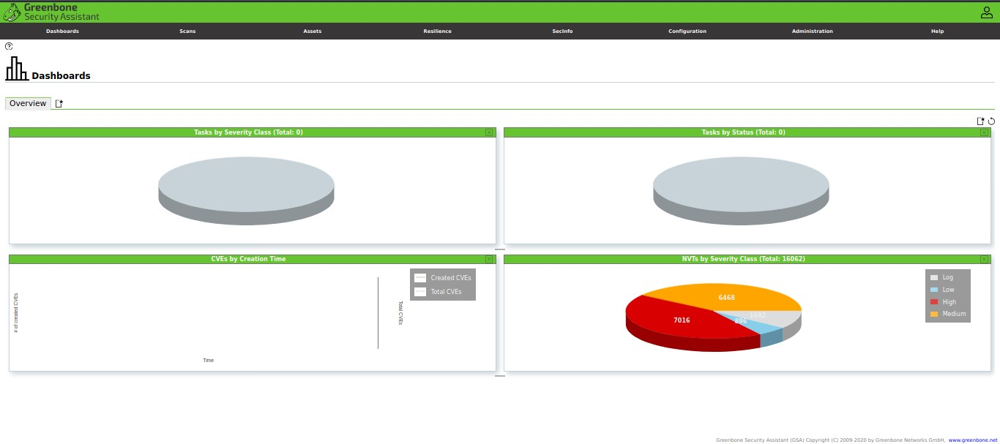

# OpenVAS

### Installing OpenVAS

Before installing OpenVAS, the first thing we need to do is ensure your system is up to date.

**NOTE:** Skip this step if you have an updated system:

```
sudo apt-get update
sudo apt-get dist-upgrade
```

Once you have your system up to date, we can install OpenVAS:

```
sudo apt-get install openvas
```

Having installed OpenVAS successfully, you will have access to the setup script. Launch it to configure OpenVAS for first-time use:

```
sudo gvm-setup
```

**NOTE:** Depending on your system configuration, you may need to install an SQLite database.

Remember to note down the password generated during the setup process as you will require it to log in to the Greenbone Security Assistant web interface.

### Starting and Stopping OpenVAS

If you have OpenVAS configured properly, you can run it by executing the command:

```
sudo gvm-start
```

This command should launch the OpenVAS service and open the browser. You can manually navigate to the web interface using the default listening ports.


This command should launch the services listening on port 9390 and 9392

### Troubleshooting Errors

Installing OpenVAS on older versions of Kali and other Debian flavors may result in some errors. Here’re some possible ways of fixing possible errors:

### Install PostgreSQL or SQLite3 database

```
sudo apt-get install postgresql
sudo service postgresql start
sudo apt-get install sqlite3
sudo service sqlite3 start
```

Next, use gvm commands:

```
sudo apt install gvm –y
sudo gvm-setup
sudo gvm-feed-update
sudo gvm-start
```

**NOTE:** Depending on the version you have installed, you may need to use the gvm (Greenbone Vulnerability Manager) command other than OpenVAS.

### Accessing OpenVAS Web UI

Using the Greenbone Security Assistant features, you can access the OpenVAS web UI from your local machine. You will need to have OpenVAS running to access the interface.

Open your browser and navigate to [http://localhost:9392](http://localhost:9392)

Use the username as admin and the password generated in the setup process.


